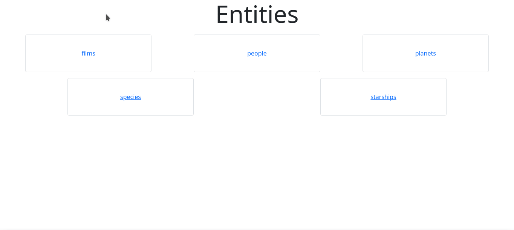

# API Consumer Vanilla JS

#### Consumidor de API desenvolvido em Vanilla JS



Caso queira exibir outras entidades ou campos, basta adicioná-los no arquivo [constants.js](scripts/constants.js).

## Execução

1. Clone este repositório
```
git clone https://github.com/vitor-msp/api-consumer-vanilla-js.git
```

2. Accesse a pasta baixada
```
cd api-consumer-vanilla-js
```

3. Execute o arquivo index.html no servidor web de sua preferência.

    Uma forma fácil é utilizar a extensão [live server](https://marketplace.visualstudio.com/items?itemName=ritwickdey.LiveServer) no [vscode](https://code.visualstudio.com/)